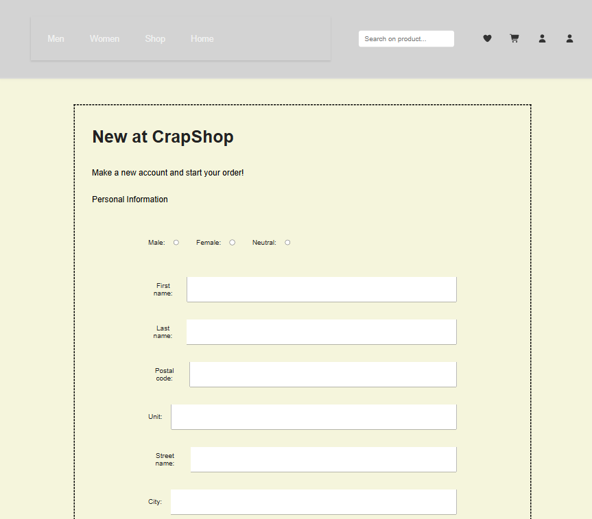
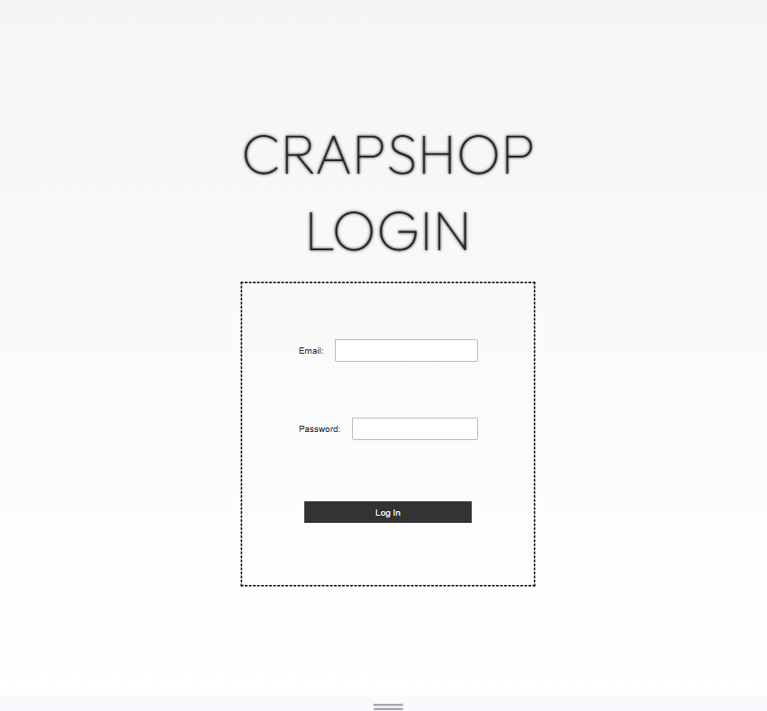
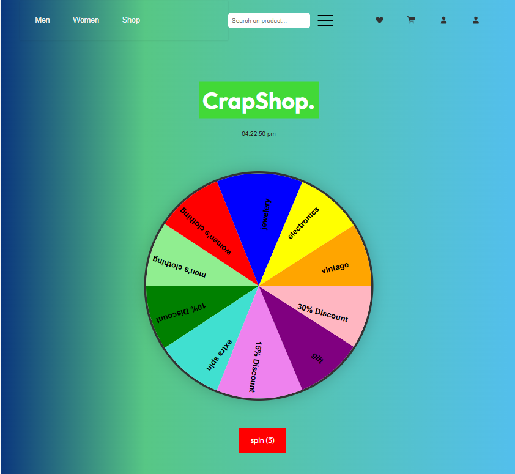
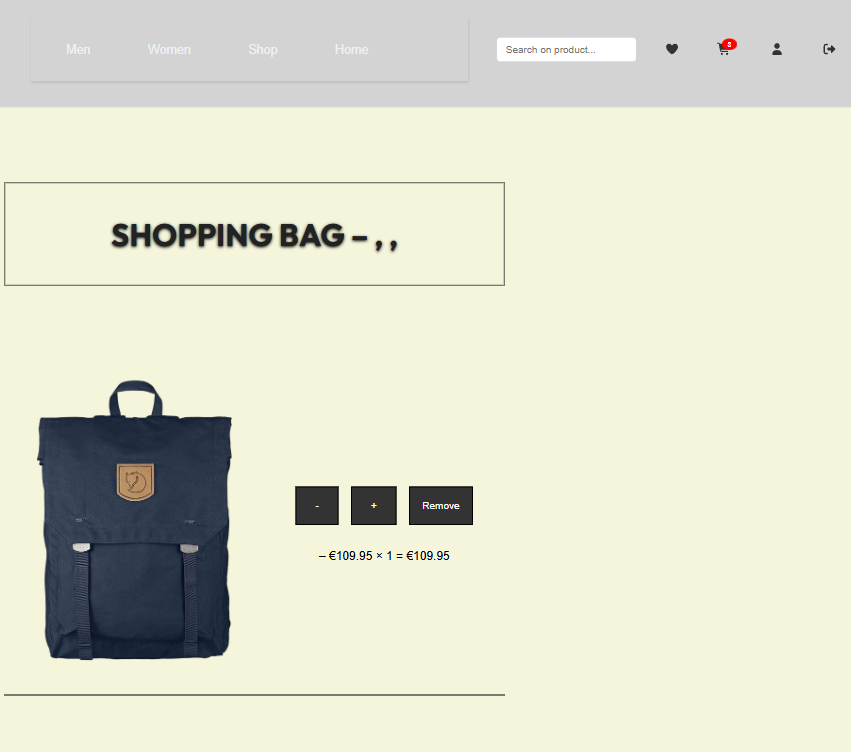

Crapshop

. Inleiding 

Welkom bij CrapShop,
 
Crapshop is een gift/webshop, dit project is voor mij begonnen als een eigen idee waar ik mij geleerde skills wilde toepassen, en 
experimenteer met javascript en react. Ik heb dit idee gekozen omdat ik het nu kan afmaken. 
In deze webshop zit een wheel of fortune feature, gebruikers hebben 3 spins, waarmee ze korting kunnen winnen; En een willekeurige keuze hebben.
Waardoor je kado altijd origineel is. Het probleem wat ik hiermee wil oplossen is het stimuleren van impulsief koop gedrag. Het is ook een interactive feature wat amusement is
en wat het leuk maakt om op deze website te shoppen. Ook is dit wat je niet tegenkomt op een webshop en dat maakt mij applicatie origineel.

. Deze applicatie is gemaakt met vite de benodigde runtime environment en commando's die je nodig heb om deze applicatie te starten
een code-editor met terminal dit kan Visual studio code zijn of Webstorm.

. Benodigdheden

Code-editor dat kan zijn visual studio of webstorm 

Een runtime environment zoals node.js 

. Instalatie handleiding 

1. Om te beginnen start je een nieuw project in webstorm als je node.js nog niet geïnstalleerd heb dan begin je daarmee door het commando ui te voeren in de terminal

npm install -g npm

2. We gaan nu vite installeren in je project dat doe je door het volgende commando uit te voeren

npm create vite@latest

Volg de instructies in de terminal en de benodigde packages worden in je root gezet.

3. Na het commando hebben ingevoerd wordt er in de terminal aangegeven welke commando je moet uitvoeren dat is

npm i of npm install 

om het project te install in je hoofd map 

4. Om de vite server te starten gebruik het volgende commando 

npm run dev 

je ziet op welke server de localhost is door deze link aanklikken kom je op de webpagina

. Registreren/Inloggen 

In deze applicatie maak je een nieuw account aan en met dat account kan je inloggen

1. Druk op de knop registreren om een nieuw account aan te maken je wordt dan doorgestuurd naar de inlog pagina
2. Voer je gegevens in je wordt ingelogd en doorgestuurd naar de homepagina 

. Wheel-Of-Fortune

1. Gebruiker heeft 3 spins druk op de button
2. Win een korting en wordt doorgestuurd naar pagina
3. spins worden opgeslagen en kunnen op elk gewenst moment gebruikt worden 

. Winkel wagen

Shoppen in de webshop

1. Selecteer het artikel in de shop je wordt doorgestuurd naar de detailpagina.
2. op de detailpagina staat de omschrijving er is een knop om aan de cart toe te voegen en een favorieten knop
3. artikel wordt aan de winkelmand toegevoegd of aan de favorieten

